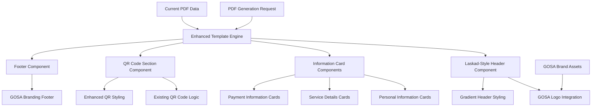
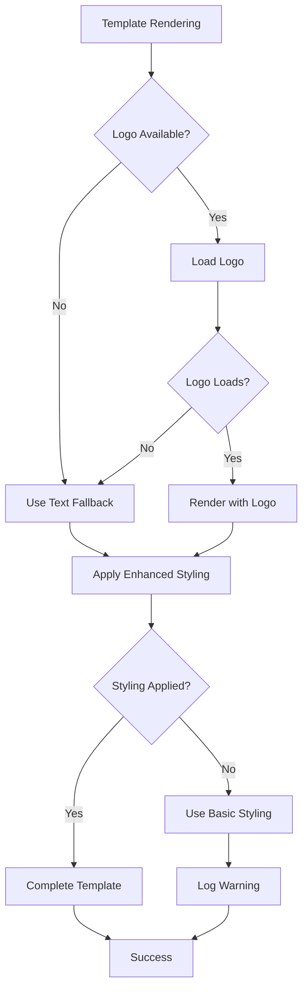

# Design Document

## Overview

The Laskad-Style PDF Template Enhancement transforms the existing GOSA PDF template to follow the clean, professional design pattern shown in the reference image while maintaining GOSA branding and current functionality. The design preserves the existing template structure and content organization while applying modern visual styling, improved typography, and a more professional layout that enhances readability and user experience.

The enhancement focuses on visual improvements rather than structural changes, ensuring compatibility with existing PDF generation systems while delivering a more polished and professional appearance that reflects the quality of the GOSA Convention.

## Architecture

### Template Architecture



### Visual Design System

The design system maintains GOSA brand identity while adopting the clean, structured layout from the Laskad reference:

- **Color Palette**: GOSA green (#16A34A) to amber (#F59E0B) gradient header
- **Typography**: Clean, hierarchical text with gray labels and dark values
- **Layout**: Card-based information sections with proper spacing
- **Branding**: Prominent GOSA logo and consistent brand messaging

## Components and Interfaces

### 1. Enhanced Header Component

**Purpose**: Create a professional header with GOSA branding following the Laskad layout pattern.

**Design Specifications**:
```css
.enhanced-header {
  background: linear-gradient(135deg, #16A34A 0%, #F59E0B 100%);
  color: white;
  padding: 30px 40px;
  display: flex;
  justify-content: space-between;
  align-items: center;
}

.logo-section {
  display: flex;
  align-items: center;
}

.service-title {
  font-size: 24px;
  font-weight: 600;
  text-align: right;
}
```

**Template Structure**:
```html
<div class="enhanced-header">
  <div class="logo-section">
    
    <div class="brand-text">GOSA</div>
  </div>
  <div class="service-title">
    {Service Type} Details
  </div>
</div>
```

### 2. Information Card System

**Purpose**: Present information in clean, scannable cards following the Laskad design pattern.

**Card Component Design**:
```css
.info-card {
  background: white;
  border-radius: 12px;
  padding: 24px;
  margin-bottom: 20px;
  box-shadow: 0 2px 8px rgba(0,0,0,0.1);
  border-left: 4px solid #16A34A;
}

.card-section {
  margin-bottom: 24px;
}

.section-title {
  font-size: 14px;
  font-weight: 600;
  color: #6B7280;
  text-transform: uppercase;
  letter-spacing: 0.5px;
  margin-bottom: 8px;
}

.section-value {
  font-size: 18px;
  font-weight: 600;
  color: #1F2937;
  line-height: 1.4;
}

.amount-display {
  font-size: 32px;
  font-weight: 700;
  color: #16A34A;
}

.status-badge {
  display: inline-flex;
  align-items: center;
  padding: 6px 12px;
  background: #DCFCE7;
  color: #166534;
  border-radius: 20px;
  font-size: 14px;
  font-weight: 600;
}

.status-badge::before {
  content: "✓";
  margin-right: 6px;
  color: #16A34A;
}
```

### 3. Enhanced QR Code Section

**Purpose**: Maintain existing QR code functionality while applying consistent Laskad-style design.

**QR Section Design**:
```css
.qr-card {
  background: white;
  border-radius: 12px;
  padding: 32px;
  text-align: center;
  box-shadow: 0 2px 8px rgba(0,0,0,0.1);
  border: 2px dashed #16A34A;
}

.qr-title {
  font-size: 18px;
  font-weight: 600;
  color: #16A34A;
  margin-bottom: 16px;
}

.qr-code-image {
  margin: 20px auto;
  border-radius: 8px;
  box-shadow: 0 4px 12px rgba(0,0,0,0.15);
}

.qr-instructions {
  font-size: 14px;
  color: #6B7280;
  line-height: 1.6;
  margin-top: 16px;
}
```

### 4. Professional Footer Component

**Purpose**: Provide consistent GOSA branding and contact information in the footer.

**Footer Design**:
```css
.enhanced-footer {
  background: #F9FAFB;
  padding: 24px 40px;
  border-top: 1px solid #E5E7EB;
  text-align: center;
}

.footer-brand {
  font-size: 16px;
  font-weight: 600;
  color: #16A34A;
  margin-bottom: 8px;
}

.footer-contact {
  font-size: 14px;
  color: #6B7280;
  line-height: 1.5;
}

.footer-timestamp {
  font-size: 12px;
  color: #9CA3AF;
  margin-top: 12px;
}
```

## Data Models

### Enhanced Template Data Structure

The existing PDFData structure remains unchanged, but the template rendering is enhanced:

```typescript
interface EnhancedTemplateData extends PDFData {
  // Existing structure maintained
  userDetails: {
    name: string;
    email: string;
    phone: string;
    registrationId: string;
  };
  operationDetails: {
    type: ServiceType;
    amount: number;
    paymentReference: string;
    date: Date;
    status: string;
    description: string;
    additionalInfo?: string;
  };
  qrCodeData: string;
  
  // Enhanced template metadata
  templateMetadata?: {
    headerTitle: string;
    brandingElements: string[];
    customStyling?: Record<string, string>;
  };
}
```

### Service-Specific Template Customization

Each service type maintains its current content structure but with enhanced visual presentation:

```typescript
interface ServiceTemplateConfig {
  headerTitle: string;
  primarySections: string[];
  highlightFields: string[];
  customInstructions?: string;
}

const SERVICE_TEMPLATES: Record<ServiceType, ServiceTemplateConfig> = {
  convention: {
    headerTitle: "Convention Registration",
    primarySections: ["Personal Information", "Registration Details", "QR Code"],
    highlightFields: ["amount", "registrationId", "status"]
  },
  dinner: {
    headerTitle: "Dinner Reservation",
    primarySections: ["Personal Information", "Dinner Details", "Guest Information", "QR Code"],
    highlightFields: ["amount", "guestCount", "dinnerDate"]
  },
  // ... other service types
};
```

## Error Handling

### Template Rendering Error Handling



### Fallback Strategies

1. **Logo Fallback**: If GOSA logo fails to load, display "GOSA" text with proper styling
2. **Styling Fallback**: If enhanced CSS fails, fall back to basic styling while maintaining readability
3. **Font Fallback**: Use web-safe font stack with appropriate fallbacks
4. **Color Fallback**: Ensure sufficient contrast even if custom colors fail to load

## Testing Strategy

### Visual Regression Testing

1. **Template Comparison Tests**:
   - Compare rendered templates against reference designs
   - Validate color accuracy and brand consistency
   - Test logo placement and sizing across different content lengths

2. **Cross-Platform Testing**:
   - Test PDF rendering across different PDF viewers
   - Validate print output quality and layout
   - Ensure mobile device compatibility

3. **Content Variation Testing**:
   - Test with various content lengths and data combinations
   - Validate layout stability with edge cases
   - Test all service types with enhanced template

### Performance Testing

1. **Rendering Performance**:
   - Measure template generation time with enhanced styling
   - Compare performance against current template
   - Test concurrent generation under load

2. **Asset Loading**:
   - Test logo loading performance and caching
   - Validate CSS rendering efficiency
   - Monitor memory usage during generation

## Security Considerations

### Asset Security

1. **Logo Protection**:
   - Ensure GOSA logo is served from secure, reliable sources
   - Implement proper fallback for logo loading failures
   - Validate logo file integrity and format

2. **Template Security**:
   - Sanitize any dynamic content in templates
   - Prevent CSS injection through user data
   - Ensure template rendering doesn't expose sensitive information

## Performance Optimization

### Template Caching Strategy

```typescript
interface TemplateCacheConfig {
  baseTemplate: string;
  compiledStyles: string;
  logoDataUrl: string;
  cacheExpiry: number;
}

class EnhancedTemplateCache {
  private static cache = new Map<string, TemplateCacheConfig>();
  
  static getCachedTemplate(serviceType: string): TemplateCacheConfig | null {
    return this.cache.get(serviceType) || null;
  }
  
  static cacheTemplate(serviceType: string, config: TemplateCacheConfig): void {
    this.cache.set(serviceType, config);
  }
}
```

### Optimization Strategies

1. **CSS Optimization**:
   - Inline critical CSS for faster rendering
   - Minimize CSS payload while maintaining design quality
   - Use efficient selectors and avoid complex calculations

2. **Asset Optimization**:
   - Convert logo to data URL for embedding
   - Optimize image sizes for PDF generation
   - Cache compiled templates for reuse

3. **Rendering Optimization**:
   - Pre-compile template components
   - Optimize DOM structure for PDF conversion
   - Minimize layout recalculations

## Implementation Approach

### Phase 1: Template Structure Enhancement

1. **Update Base Template**:
   - Modify existing HTML template structure
   - Apply Laskad-inspired layout patterns
   - Maintain existing content organization

2. **Implement Card System**:
   - Convert existing sections to card-based layout
   - Apply consistent spacing and typography
   - Ensure responsive behavior

### Phase 2: Visual Styling Implementation

1. **Header Enhancement**:
   - Implement gradient header with GOSA branding
   - Add logo integration with fallback
   - Apply professional typography

2. **Content Styling**:
   - Implement information card styling
   - Apply consistent color scheme
   - Enhance readability and visual hierarchy

### Phase 3: Integration and Testing

1. **Service Integration**:
   - Update all service-specific templates
   - Test with existing PDF generation workflow
   - Validate WhatsApp delivery compatibility

2. **Quality Assurance**:
   - Perform visual regression testing
   - Validate cross-platform compatibility
   - Test performance under load

## Deployment Considerations

### Environment Requirements

- No additional environment variables required
- Existing GOSA logo assets must be accessible
- Current PDF generation infrastructure remains unchanged

### Rollout Strategy

1. **Gradual Rollout**:
   - Deploy enhanced template alongside existing template
   - A/B test with subset of users
   - Monitor performance and user feedback

2. **Fallback Plan**:
   - Maintain ability to revert to current template
   - Implement feature flag for template selection
   - Monitor error rates and performance metrics

This design provides a comprehensive approach to enhancing the PDF template with Laskad-inspired design while maintaining GOSA branding, existing functionality, and system compatibility.