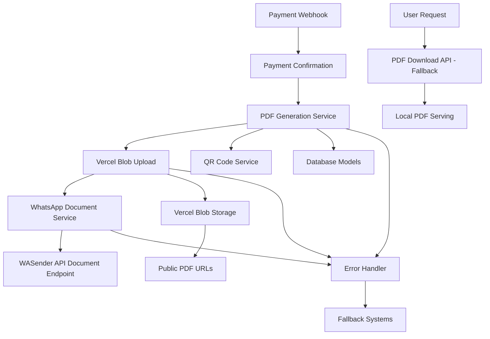
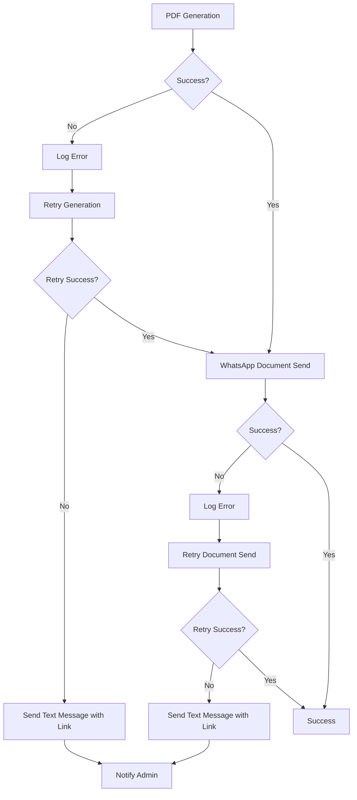

# Design Document

## Overview

The PDF WhatsApp Integration system enhances the GOSA Convention Management System by automatically generating professional PDF documents and delivering them via WhatsApp when payments are confirmed. The system leverages existing infrastructure while adding new capabilities for document generation, file hosting, and enhanced WhatsApp messaging.

The design follows a service-oriented architecture where PDF generation, file management, and WhatsApp delivery are handled by dedicated services that integrate seamlessly with the existing payment confirmation workflow.

## Architecture

### High-Level Architecture



### Service Layer Architecture

The system introduces four main services that work together:

1. **PDFGeneratorService** - Handles PDF creation with templates and content generation
2. **PDFBlobService** - Manages PDF upload to Vercel Blob storage and URL generation
3. **WhatsAppPDFService** - Orchestrates PDF delivery via WhatsApp with standardized messaging
4. **WASenderDocumentService** - Handles document delivery through WASender API

### Integration Points

- **Existing Payment Flow**: Integrates with current webhook processing
- **Database Layer**: Uses existing schemas with enhanced population
- **QR Code System**: Leverages existing QRCodeService
- **WASender API**: Extends current WhatsApp integration
- **File System**: Implements secure PDF hosting and access

## Components and Interfaces

### 1. PDF Generator Service

**Purpose**: Generate professional PDF documents with GOSA branding and service-specific content.

**Key Methods**:
```typescript
class PDFGeneratorService {
  static async generatePDFHTML(data: PDFData): Promise<string>
  static generateFilename(userDetails: UserDetails, serviceType: string): string
  private static createPDFTemplate(data: PDFData): string
  private static formatServiceDetails(operationType: string, details: any): string
}
```

**Template System**:
- Base HTML template with GOSA branding
- Service-specific content sections
- QR code embedding with proper sizing
- Responsive design for various PDF viewers

### 2. PDF Vercel Blob Storage Service

**Purpose**: Upload PDFs to Vercel Blob storage and manage secure access URLs for WhatsApp delivery.

**Key Methods**:
```typescript
class PDFBlobService {
  static async uploadPDFToBlob(pdfBuffer: Buffer, filename: string): Promise<string>
  static generateBlobFilename(userDetails: UserDetails, serviceType: string): string
  static async handleBlobUploadError(error: Error, fallbackData: PDFData): Promise<string>
}
```

**Vercel Blob Integration**:
- Upload PDFs with descriptive filenames: `gosa-2025-{serviceType}-{userName}-{timestamp}.pdf`
- Generate secure, publicly accessible URLs
- Handle upload failures with fallback mechanisms
- Optimize file sizes for WhatsApp delivery

**API Endpoints** (fallback):
```typescript
// PDF Download API (fallback when blob fails)
GET /api/v1/pdf/download?ref={paymentReference}&format={html|pdf}

// PDF View API (fallback)
GET /api/v1/pdf/view?ref={paymentReference}
```

### 3. WhatsApp PDF Service

**Purpose**: Orchestrate PDF generation and WhatsApp delivery with error handling.

**Key Methods**:
```typescript
class WhatsAppPDFService {
  static async generateAndSendPDF(data: WhatsAppPDFData): Promise<DeliveryResult>
  private static createDocumentMessage(data: WhatsAppPDFData): string
  private static handleDeliveryFailure(error: Error, data: WhatsAppPDFData): Promise<void>
}
```

**Message Templates**:
- Service-specific WhatsApp messages
- Clear instructions for PDF usage
- Professional tone with GOSA branding
- Fallback text for delivery failures

### 4. Enhanced WASender Integration with Document Delivery

**Purpose**: Extend existing WASender API integration to support document sending using Vercel Blob URLs.

**WASender Document API**:
```typescript
// API Endpoint: POST https://www.wasenderapi.com/api/send-message
interface WASenderDocumentRequest {
  to: string;           // Phone number with country code
  text: string;         // Standardized GOSA message
  documentUrl: string;  // Vercel Blob storage URL
  fileName: string;     // Descriptive filename
}
```

**Enhanced Methods**:
```typescript
class Wasender {
  static async sendDocument(data: WASenderDocumentRequest): Promise<WASenderResult>
  static async httpSenderMessage(data: WASenderMessage): Promise<WASenderResult> // existing
}
```

**Standardized Message Template**:
```
🎉 GOSA 2025 Convention
For Light and Truth

Dear {userName},

Your {serviceType} has been confirmed!

📄 Download your confirmation document:
{documentUrl}

💳 Payment Details:
• Amount: ₦{amount}
• Reference: {paymentReference}
• Status: Confirmed ✅

📱 Important Instructions:
• Click the link above to download your PDF
• Save the document to your device
• Present the QR code when required
• Keep this document for your records

🔗 Need help? Contact gosasecretariat@gmail.com

GOSA 2025 Convention Team
www.gosa.events
```

## Data Models

### PDF Data Structure

```typescript
interface PDFData {
  userDetails: {
    name: string;
    email: string;
    phone: string;
    registrationId: string;
  };
  operationDetails: {
    type: 'convention' | 'dinner' | 'accommodation' | 'brochure' | 'goodwill' | 'donation';
    amount: number;
    paymentReference: string;
    date: Date;
    status: 'confirmed' | 'pending';
    description: string;
    additionalInfo?: string;
  };
  qrCodeData: string;
}
```

### WhatsApp PDF Data Structure

```typescript
interface WhatsAppPDFData {
  userDetails: {
    name: string;
    email: string;
    phone: string;
    registrationId: string;
  };
  operationDetails: {
    type: ServiceType;
    amount: number;
    paymentReference: string;
    date: Date;
    status: string;
    description: string;
    additionalInfo?: string;
  };
  qrCodeData: string;
}
```

### Service-Specific Data Extensions

Each service type includes additional information in the PDF:

- **Convention**: Accommodation details, guest count
- **Dinner**: Guest list, dietary requirements, dinner date
- **Accommodation**: Check-in/out dates, room type, guest count
- **Brochure**: Quantity, delivery address, order type
- **Goodwill**: Message content (truncated), donation purpose
- **Donation**: Purpose, attribution details

## Error Handling

### Error Handling Strategy



### Error Types and Responses

1. **PDF Generation Failures**:
   - Template rendering errors
   - Data validation failures
   - QR code generation issues
   - Fallback: HTML version or text notification

2. **File Hosting Issues**:
   - URL generation failures
   - File access problems
   - Network connectivity issues
   - Fallback: Alternative hosting or direct email

3. **WhatsApp Delivery Failures**:
   - WASender API unavailable
   - Invalid phone numbers
   - Document size limitations
   - Fallback: Text message with PDF link

4. **Integration Errors**:
   - Database connection issues
   - Payment reference validation failures
   - User data retrieval problems
   - Fallback: Manual intervention notification

### Retry Logic

```typescript
interface RetryConfig {
  maxAttempts: number;
  backoffMultiplier: number;
  initialDelay: number;
}

const PDF_RETRY_CONFIG: RetryConfig = {
  maxAttempts: 3,
  backoffMultiplier: 2,
  initialDelay: 1000
};
```

## Testing Strategy

### Unit Testing

1. **PDF Generator Service Tests**:
   - Template rendering with various data inputs
   - Filename generation consistency
   - QR code embedding validation
   - Service-specific content formatting

2. **WhatsApp PDF Service Tests**:
   - Message template generation
   - Error handling scenarios
   - Retry logic validation
   - Fallback mechanism testing

3. **WASender Integration Tests**:
   - Document sending API calls
   - Authentication handling
   - Response parsing and error handling

### Integration Testing

1. **End-to-End PDF Flow**:
   - Payment confirmation to PDF delivery
   - Multiple service type scenarios
   - Error recovery testing
   - Performance under load

2. **API Endpoint Testing**:
   - PDF download URL validation
   - Security and authorization
   - Cache behavior verification
   - Error response handling

### Performance Testing

1. **PDF Generation Performance**:
   - Template rendering speed
   - Memory usage optimization
   - Concurrent generation handling

2. **WhatsApp Delivery Performance**:
   - Batch processing capabilities
   - Queue management efficiency
   - Rate limiting compliance

## Security Considerations

### Data Protection

1. **PDF Content Security**:
   - Sensitive data handling in templates
   - Secure temporary file management
   - Proper data sanitization

2. **Access Control**:
   - Payment reference validation
   - User authorization checks
   - Secure URL generation with expiration

3. **API Security**:
   - WASender API key protection
   - Request validation and sanitization
   - Rate limiting and abuse prevention

### Privacy Compliance

1. **Data Minimization**:
   - Include only necessary information in PDFs
   - Respect user privacy preferences
   - Secure data transmission

2. **Audit Trail**:
   - Log PDF generation and delivery events
   - Track access to PDF documents
   - Monitor for unauthorized access attempts

## Performance Optimization

### PDF Generation Optimization

1. **Template Caching**:
   - Cache compiled templates
   - Reuse common components
   - Minimize template processing time

2. **Resource Management**:
   - Efficient memory usage
   - Proper cleanup of temporary resources
   - Connection pooling for external services

### Delivery Optimization

1. **Batch Processing**:
   - Queue-based WhatsApp delivery
   - Batch API calls where possible
   - Efficient error handling and retries

2. **Caching Strategy**:
   - Cache PDF downloads with appropriate headers
   - CDN integration for static assets
   - Optimize file serving performance

## Deployment Considerations

### Environment Configuration

1. **Required Environment Variables**:
   - `WASENDER_API_KEY` - WASender API authentication
   - `BLOB_READ_WRITE_TOKEN` - Vercel Blob storage authentication
   - `NEXTAUTH_URL` - Base URL for fallback PDF download links (www.gosa.events)
   - `PDF_CACHE_DURATION` - PDF cache control settings

2. **Service Dependencies**:
   - MongoDB for data retrieval
   - Vercel Blob storage for PDF hosting
   - WASender API for document delivery
   - Existing QR Code Service integration

### Monitoring and Logging

1. **Key Metrics**:
   - PDF generation success rate
   - WhatsApp delivery success rate
   - Average processing time
   - Error rates by type

2. **Logging Strategy**:
   - Structured logging for PDF operations
   - Error tracking and alerting
   - Performance monitoring and optimization

This design provides a comprehensive foundation for implementing PDF WhatsApp integration while maintaining system reliability, security, and performance.